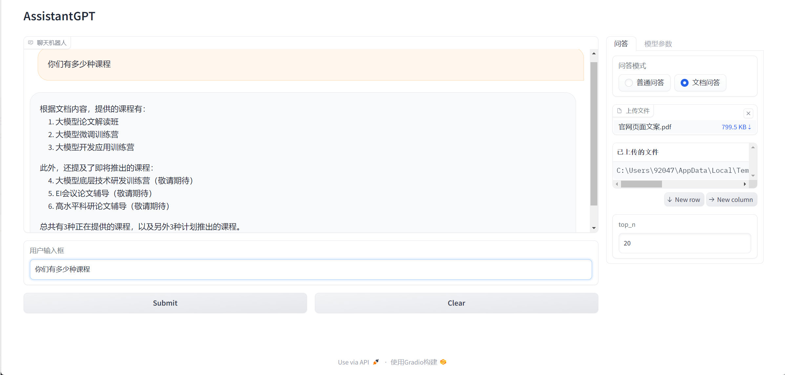

# 介绍



# 运行
1、创建虚拟环境并安装依赖
   - conda create -n py38_AssistantGPT python=3.8
   - conda activate py38_AssistantGPT
   - pip install -r requirements.txt

2、配置环境变量
   - 打开`.env.example`文件
   - 填写完整该文件中的`OPENAI_API_KEY`、`HTTP_PROXY`、`HTTPS_PROXY`三个环境变量
   - 把`.env.example`文件重命名为`.env`

3、docker运行`qdtant`容器

4、运行`app.py`文件

成功启动时终端输出示例：
```bash
> python app.py
Running on local URL:  http://127.0.0.1:7860

To create a public link, set `share=True` in `launch()`.
```

## 运行日志

### 上传文件

之前上传成功过：

```bash
2024-01-25 14:40:51.643 | TRACE    | __main__:fn_upload_files:172 - 组件输入 | unuploaded_file_paths: ['C:\\Users\\92047\\AppData\\Local\\Temp\\gradio\\2def4c9f9f49eebf9d276d42bf0badb385ce439d\\sample-pdf.pdf']
2024-01-25 14:40:51.644 | DEBUG    | utils:upload_files:86 - 输入参数 | file_path: C:\Users\92047\AppData\Local\Temp\gradio\2def4c9f9f49eebf9d276d42bf0badb385ce439d\sample-pdf.pdf <class 'str'>
2024-01-25 14:40:51.644 | TRACE    | utils:upload_files:100 - 文件允许被处理 | file_path: C:\Users\92047\AppData\Local\Temp\gradio\2def4c9f9f49eebf9d276d42bf0badb385ce439d\sample-pdf.pdf
2024-01-25 14:40:51.644 | DEBUG    | utils:upload_files:107 - 文件信息 | file_name: sample-pdf.pdf, file_extension: .pdf, file_md5: e41ab92c3f938ddb3e82110becbbce3e
2024-01-25 14:40:52.162 | SUCCESS  | db_qdrant:get_points_count:43 - 库里已有该集合 | collection_name：e41ab92c3f938ddb3e82110becbbce3e points_count：1
```